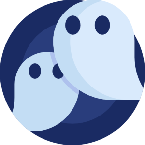

---
hide:
  - navigation
  - toc
---
# CWD Tools for Improving Cyber Simulations

Download the open source software tools that the SEI developed to create realistic cyber simulations or access information to learn more about each one.  

<html>
<head>
  <link rel="stylesheet" href="https://maxcdn.bootstrapcdn.com/bootstrap/4.5.2/css/bootstrap.min.css">
</head>
<body>
    

        

            

                
                

                    <h1 class="card-title">Crucible</h1>
                    
Powerful, open source, cyber-simulation framework that delivers cost-effective, scalabe and dynamic virtual environments. Download Crucible or learn more about it in this collection.

                    <a href="https://cmu-sei.github.io/crucible/" class="btn btn-link">Learn More</a>
                

            

        

        

            

                
                

                    <h1 class="card-title">GHOSTS</h1>
                    
Non-player character (NPC) orchestration gneerator developed by the SEI to create realistic NPCs and network traffic for cyber-training simulations. Download the tool or read more about it in this collection.

                    <a href="https://cmu-sei.github.io/GHOSTS/" class="btn btn-link">Learn More</a>
                

            

        

        

            

                
                

                    <h1 class="card-title">TopoMojo</h1>
                    
Open Source tool that contains both a lab builder and [lauer so that lab creators can build, share, and deploy labs quickly. Read more about it or download the tool in this collection.

                    <a href="https://github.com/cmu-sei/TopoMojo" class="btn btn-link">Learn More</a>
                

            

        

        

            

                
                

                    <h1 class="card-title">WELLE-D</h1>
                    
A virtual wireless networking environemnt for hosting realistic training where participants can develop wireless security skills in a cost-effective and controlled way. Download the tool or learn more about it in this collection.

                    <a href="https://github.com/cmu-sei/welled" class="btn btn-link">Learn More</a>
                

            

        

        

            

                
                

                    <h1 class="card-title">Foundry</h1>
                    
Training asset management portal that functions as a hub for training content to help you optimize your use of training assets. Download or access documentation in this collection.

                    <a href="https://github.com/cmu-sei/foundry-appliance" class="btn btn-link">Learn More</a>
                

            

        

        

            

                
                

                    <h1 class="card-title">GreyBox</h1>
                    
Software tool that gives cyber-exercise participants the perception that they are connected to the real Internet in disconnected training environments. Learn more about it or download it in this collection.

                    <a href="https://github.com/cmu-sei/greybox" class="btn btn-link">Learn More</a>
                

            

        

    

</body>

